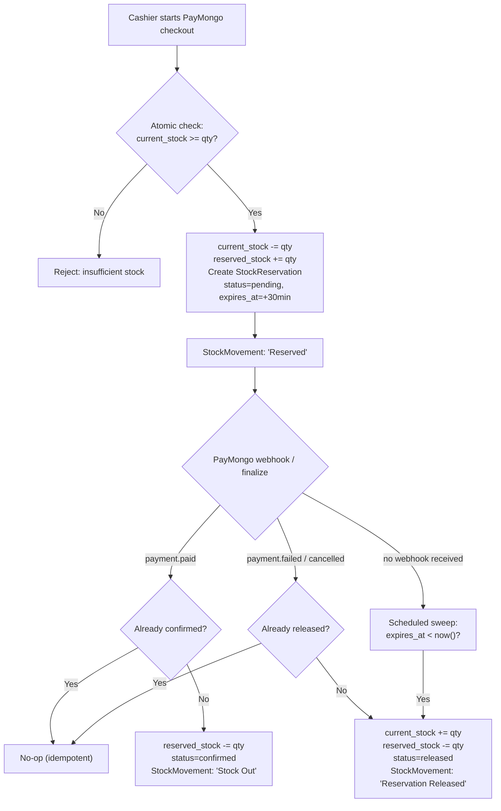
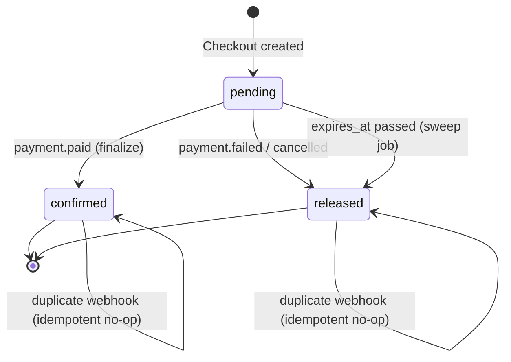
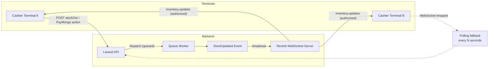

# WiWaste Implementation Plan (Revised)

## Overview
Address critical gaps between frontend and backend, connect mock data to real APIs, and implement real-time stock synchronization using Laravel Reverb.

**Revision notes (v2):** Reordered so the CRITICAL financial-integrity fix (stock reservation) ships and validates before the HIGH-priority UX work goes to production. Added a reservation-expiry sub-phase, concurrency-safety details, webhook idempotency, channel authorization, and diagrams for the stock flow, reservation state machine, and Reverb architecture. Testing checklist expanded to cover concurrency and previously-untested phases.

---

## Phase Ordering (Changed)

| Order | Phase | Priority | Why moved |
|-------|-------|----------|-----------|
| 1 | PayMongo Stock Reservation | **CRITICAL** | Real money + oversell risk; should validate in staging before other work ships to prod |
| 2 | Recommendations API | HIGH | UX/data completeness, no financial risk |
| 3 | Reverb Real-time Sync | HIGH | Depends conceptually on Phase 1's stock fields (`reserved_stock`) |
| 4 | Remaining Mock Data | MEDIUM | unchanged |
| 5 | Audit Logs Frontend | LOW | unchanged |
| 6 | ML Resilience | LOW | unchanged |
| 7 | Role-Based UI Permissions | FUTURE | unchanged |

Recommendation: do not enable `STOCK_RESERVATION_ENABLED` in production until the concurrency tests in the checklist below pass in staging against the real PayMongo sandbox.

---

## Phase 1: Fix PayMongo Stock Race Condition (Priority: CRITICAL) — *moved up from Phase 2*

### Objective
Reserve stock during PayMongo checkout so it's not available to other cashiers while payment is pending, with no window where two cashiers can sell the same unit.

### Database Migration
```php
// New migration: add reserved_stock to Inventory table
Schema::table('Inventory', function (Blueprint $table) {
    $table->unsignedInteger('reserved_stock')->default(0)->after('current_stock');
});

// New migration: reservation tracking table (for expiry + idempotency)
Schema::create('stock_reservations', function (Blueprint $table) {
    $table->id();
    $table->foreignId('product_id')->constrained('Inventory');
    $table->foreignId('sale_transaction_id')->nullable()->constrained();
    $table->string('paymongo_checkout_id')->unique();
    $table->unsignedInteger('quantity');
    $table->enum('status', ['pending', 'confirmed', 'released'])->default('pending');
    $table->timestamp('expires_at');
    $table->timestamps();
});
```

**Why the extra table:** a single `reserved_stock` counter can't tell you *which* checkout owns a reservation, can't detect a duplicate webhook, and can't be swept for expiry. The counter stays for fast reads; `stock_reservations` is the source of truth for state transitions.

### Concurrency Safety (new — was missing in v1)
- All reserve/release/confirm operations run inside a DB transaction using `lockForUpdate()` on the `Inventory` row, or an atomic conditional update (`UPDATE Inventory SET current_stock = current_stock - ? WHERE id = ? AND current_stock >= ?`) and check affected row count. **Never** read-then-write across two queries.
- `finalize()` is idempotent: before converting a reservation to a sale, check `stock_reservations.status`. If already `confirmed`, return the existing result instead of decrementing again — PayMongo webhooks can be redelivered.
- A state machine guards transitions so a late `payment.failed` can't undo an already-`confirmed` reservation, and a duplicate `payment.paid` can't double-confirm.

### Reservation Expiry (new sub-phase — was missing in v1)
If a customer abandons checkout, no webhook may ever fire. Without expiry, that stock is locked forever.

| File | Purpose |
|------|---------|
| `Backend/app/Console/Commands/ReleaseExpiredReservations.php` | Scheduled command: finds `stock_reservations` where `status = 'pending'` and `expires_at < now()`, releases them |
| `Backend/app/Console/Kernel.php` | Schedule the command every 1–5 minutes |

`expires_at` should be set to the PayMongo checkout session TTL (typically ~30 min) at reservation time.

### Files to Modify
| File | Changes |
|------|---------|
| `Backend/app/Models/Inventory.php` | Add `reserved_stock` to `$fillable`, add `availableStock()` accessor (`current_stock - reserved_stock`) |
| `Backend/app/Models/StockReservation.php` | New model with status transitions |
| `Backend/app/Http/Controllers/Api/SalesTransactionController.php` | In `store()`: when `payment_method === 'PayMongo'`, reserve stock atomically, create `StockReservation` row with `expires_at` |
| `Backend/app/Http/Controllers/Api/PayMongoController.php` | In `finalize()`: idempotent confirm (reservation → sale); add `releaseReservation()` for failed/cancelled payments |
| `Backend/app/Jobs/ProcessPayMongoWebhook.php` | Handle `payment.failed` / `payment.cancelled`; guard against out-of-order/duplicate delivery |
| `Backend/app/Console/Commands/ReleaseExpiredReservations.php` | New scheduled sweep |
| `Frontend/src/pages/cashier/POSTerminal.tsx` | Display `availableStock` (current − reserved) in product grid; disable add when `availableStock <= 0` |

### Stock Flow



### Reservation State Machine



### Acceptance Criteria
- Two cashiers cannot sell the same reserved unit (verified under concurrent load, not just sequential testing)
- Failed PayMongo payment releases stock back to available
- Abandoned checkouts release stock automatically within the sweep interval
- Duplicate/out-of-order webhooks never double-decrement or double-release stock
- Audit trail shows reservation → sale or reservation → release, with no orphaned `pending` rows after expiry

---

## Phase 2: Connect Recommendations to Real API (Priority: HIGH) — *moved down from Phase 1*

### Objective
Replace static `MOCK_RECS` in `Recommendations.tsx` with live API calls.

### Files to Modify
| File | Changes |
|------|---------|
| `Frontend/src/pages/inventory/Recommendations.tsx` | Replace mock data with `useApi(recommendations.list)`, wire approve/reject to real endpoints |
| `Frontend/src/hooks/useApi.ts` | Verify pagination/error handling works with recommendations endpoint |

### API Endpoints (Already Exist)
- `GET /api/recommendations` - List with status filter
- `GET /api/recommendations/{id}` - Detail
- `POST /api/recommendations/{id}/approve` - Approve
- `POST /api/recommendations/{id}/reject` - Reject with reason

### Implementation Steps
1. Remove `MOCK_RECS` constant and `mockRecs` state
2. Use `useApi(recommendations.list({ status: statusFilter }))` for data fetching
3. Map API response to UI format (field names match: `recommendation_id`, `product_name`, `sku`, `category`, `current_stock`, `recommended_stock`, `confidence_score`, `recommendation_type`, `status`, `rejection_reason`, `reviewed_by`)
4. Replace `handleApprove` → `recommendations.approve(id)`
5. Replace `handleReject` → `recommendations.reject(id, reason)`
6. Add loading/error states (follow `LeakageDetectionPage` pattern)
7. Remove mock workflow steps, derive from real `status` field

### Acceptance Criteria
- Recommendations load from database
- Approve/Reject persists to database
- Audit log created on approve/reject
- Pagination works for large datasets

---

## Phase 3: Real-time Stock Synchronization via Laravel Reverb (Priority: HIGH)

### Objective
Broadcast stock changes to all connected cashier terminals instantly.

### Infrastructure Setup
1. **Install Laravel Reverb**
   ```bash
   composer require laravel/reverb
   php artisan reverb:install
   ```

2. **Configure `.env`**
   ```
   BROADCAST_CONNECTION=reverb
   REVERB_HOST=0.0.0.0
   REVERB_PORT=8080
   REVERB_SCHEME=http
   REVERB_APP_ID=wiwaste
   REVERB_APP_KEY=local-key
   REVERB_APP_SECRET=local-secret
   ```

3. **Run Reverb Server + Queue Worker** *(queue worker added — new)*
   ```bash
   php artisan reverb:start --host=0.0.0.0 --port=8080
   php artisan queue:work --queue=broadcasts
   ```
   `StockUpdated` must implement `ShouldBroadcast` **and** `ShouldQueue` — otherwise every stock mutation blocks the HTTP request on the WebSocket push. This makes a running queue worker a hard infra requirement, not optional tooling.

### Backend: Broadcast Events
| File | Purpose |
|------|---------|
| `Backend/app/Events/StockUpdated.php` | Queued event with `product_id`, `current_stock`, `reserved_stock`, `available_stock`, `stock_status` |
| `Backend/routes/channels.php` | Define channel `inventory.updates` **with role-based auth callback** — restrict to authenticated cashier/inventory/admin roles, not any authenticated user |
| `Backend/app/Http/Controllers/Api/InventoryController.php` | Dispatch `StockUpdated` after `stockIn`, `stockOut`, PayMongo finalize, reservation release |
| `Backend/app/Http/Controllers/Api/SalesTransactionController.php` | Dispatch after PayMongo reservation |
| `Backend/app/Http/Controllers/Api/PayMongoController.php` | Dispatch after finalize/release |

### Frontend: Consume Events
| File | Purpose |
|------|---------|
| `Frontend/src/hooks/useInventorySync.ts` | New hook: connects to Laravel Echo, subscribes to channel, updates local state; **falls back to polling on WebSocket disconnect** |
| `Frontend/src/pages/cashier/POSTerminal.tsx` | Use hook to sync `stockAdjustments` and product grid in real-time |
| `Frontend/src/pages/inventory/ManageInventory.tsx` | Use hook for live table updates |
| `Frontend/src/pages/inventory/Recommendations.tsx` | Optional: refresh when stock changes affect recommendations |

### Architecture



### Channel Strategy
- **Option A**: Single channel `inventory.updates` - all clients receive all changes (simpler, more traffic)
- **Option B**: Per-product channels `inventory.{product_id}` - granular, less traffic, more connections
- **Recommendation**: Start with **Option A** (single channel) for simplicity; optimize later if needed

### Scaling Note (new)
Reverb's default local driver does not share state across multiple app server instances. If WiWaste ever runs more than one Laravel process (horizontal scaling, blue/green deploys), switch the broadcaster to the Redis-backed configuration before going multi-instance — otherwise clients connected to one instance won't see events dispatched from another.

### Echo Configuration (Frontend)
```typescript
// Frontend/src/services/echo.ts
import Echo from 'laravel-echo';
import Pusher from 'pusher-js';

window.Pusher = Pusher;

export const echo = new Echo({
  broadcaster: 'reverb',
  key: import.meta.env.VITE_REVERB_APP_KEY,
  wsHost: import.meta.env.VITE_REVERB_HOST,
  wsPort: import.meta.env.VITE_REVERB_PORT,
  wssPort: import.meta.env.VITE_REVERB_PORT,
  forceTLS: import.meta.env.VITE_REVERB_SCHEME === 'https',
  enabledTransports: ['ws', 'wss'],
  authEndpoint: `${import.meta.env.VITE_API_URL.replace('/api', '')}/broadcasting/auth`,
});
```

### Acceptance Criteria
- Stock change on one terminal appears on another within <500ms
- No full-page refresh needed
- Works across multiple cashier tabs/browsers
- **Polling fallback is mandatory (not optional)** if WebSocket disconnects — a silent desync on a POS terminal risks overselling at the register
- Channel subscription is rejected for unauthorized roles

---

## Phase 4: Replace Remaining Mock Data (Priority: MEDIUM)

### Pages & Data Sources

| Page | Current Mock | Real API Endpoint | Effort |
|------|--------------|-------------------|--------|
| `InventoryPerformance.tsx` | `TURNOVER_DATA`, `TOP_PRODUCTS` | `inventoryAnalytics.turnover()`, `inventoryAnalytics.dashboardSummary()` | Low |
| `CashierHistory.tsx` | `initialSalesTransactions` | `sales.list({ cashier_id: currentUser })` | Low |
| `Dashboard.tsx` | Static KPIs | `dashboard.overview()` | Low |
| `PredictiveAnalytics.tsx` | `data?.predictiveAnalytics?.seasonalTrends` | `forecast.overview()`, `lossRisk.summary()` | Medium |
| `LeakageDetectionPage.tsx` | Uses real API ✓ | Already connected | Done |
| `Replenishment.tsx` | Uses real API ✓ | Already connected | Done |

### Implementation Approach
1. **InventoryPerformance**: Replace static arrays with `useApi(inventoryAnalytics.turnover())` and `useApi(inventoryAnalytics.dashboardSummary())`. Transform API response to chart format.
2. **CashierHistory**: Add `user_id` filter to `sales.list()`, use `useApi` hook, add pagination.
3. **Dashboard sub-pages**: Audit each for mock data, replace with appropriate API calls.

### Acceptance Criteria
- All dashboard pages show live data
- Cashier history shows only current user's transactions
- Charts render with real data
- Loading/error states present

---

## Phase 5: Audit Logs Frontend Integration (Priority: LOW)

### Objective
Ensure `AuditLogs.tsx` uses real API with full filtering.

### Files to Verify/Modify
| File | Action |
|------|--------|
| `Frontend/src/pages/admin/AuditLogs.tsx` | Verify it uses `auditLogs.list()` with search, action, entity_type, page params |
| `Frontend/src/services/api.ts` | `auditLogs.list()` already exists with full filter support |

### Features to Add
- Export to CSV (backend already supports, add frontend button)
- Date range filter (add `from`/`to` params to API)
- Real-time updates via Reverb (optional)

---

## Phase 6: ML Service Resilience & Error Handling (Priority: LOW)

### Backend Improvements
| File | Improvement |
|------|-------------|
| `Backend/app/Services/Ml/MlServiceClient.php` | Add retry with exponential backoff (3 retries), circuit breaker pattern |
| `Backend/app/Http/Controllers/Api/ForecastController.php` | Better error messages when ML service down |
| `Backend/app/Http/Controllers/Api/LossPredictionController.php` | Same |
| `Backend/app/Http/Controllers/Api/OptimizationController.php` | Same |

### Frontend Improvements
- Show "ML service unavailable" banner when forecast/loss-risk/optimization endpoints return 503
- Add "Retry" button that calls generate endpoint
- Cache last successful results longer (extend cache TTL)

---

## Phase 7: Role-Based UI Permissions (Priority: FUTURE)

### Roles
- **Admin**: Full access (users, settings, audit logs, all reports)
- **Inventory**: Stock management, wastage, recommendations, FEFO, purchase orders
- **Business Owner**: Dashboard, analytics, reports, profit/loss, executive views

### Implementation
1. Add `usePermissions()` hook reading `user.role` from auth context
2. Create `<Can role="Admin|Inventory|Business Owner">` component
3. Wrap navigation items, page access, action buttons
4. Backend: Add middleware to enforce on API routes (optional, defense in depth)

---

## Technical Dependencies

### New Packages Required
| Package | Purpose | Phase |
|---------|---------|-------|
| `laravel/reverb` | WebSocket server | Phase 3 |
| `beyondcode/laravel-websockets` | Alternative if Reverb issues | Phase 3 (fallback) |
| `pusher/pusher-php-server` | Laravel Echo backend | Phase 3 |

### Frontend Dependencies (Already Installed)
- `laravel-echo` - WebSocket client
- `pusher-js` - Pusher protocol support
- `recharts` - Charts (already used)

---

## Testing Checklist

### Phase 1: PayMongo Stock (expanded)
- [ ] Create PayMongo checkout → stock reserved (not available)
- [ ] Second cashier cannot add reserved stock to cart
- [ ] Payment success → reservation becomes sale, StockMovement created
- [ ] Payment fail/cancel → stock released back to available
- [ ] Audit log shows reservation → sale or reservation → release
- [ ] **Concurrency: two simultaneous checkout requests against 1 unit of stock → only one succeeds**
- [ ] **Duplicate webhook delivery (same `payment.paid` sent twice) → stock decremented only once**
- [ ] **Out-of-order webhooks (`payment.failed` arrives after `finalize()` already confirmed) → confirmed state is not overwritten**
- [ ] **Abandoned checkout with no webhook → sweep job releases reservation after `expires_at`**
- [ ] **No `pending` reservations remain unresolved after 24h in staging soak test**

### Phase 2: Recommendations
- [ ] Load recommendations from API
- [ ] Approve recommendation → status changes, audit log created
- [ ] Reject with reason → status changes, audit log created
- [ ] Pagination works
- [ ] Filter by status works

### Phase 3: Reverb Sync
- [ ] Reverb server starts without errors
- [ ] StockIn on Terminal A → Terminal B updates within 500ms
- [ ] PayMongo reservation on Terminal A → Terminal B shows reduced available
- [ ] WebSocket reconnects after network interruption
- [ ] **Polling fallback activates automatically when WebSocket fails (required, not optional)**
- [ ] **Unauthorized role cannot subscribe to `inventory.updates`**
- [ ] **Broadcast events process via queue worker without blocking API response time**

### Phase 4: Mock Data
- [ ] InventoryPerformance shows real turnover data
- [ ] CashierHistory shows only current cashier's transactions
- [ ] All dashboard KPIs from live API

### Phase 5: Audit Logs (new)
- [ ] CSV export produces correct filtered rows
- [ ] Date range filter narrows results correctly
- [ ] Filters combine correctly (search + action + entity_type + date range)

### Phase 6: ML Resilience (new)
- [ ] Simulated ML service outage triggers retry with backoff, then circuit breaker
- [ ] Frontend shows "ML service unavailable" banner on 503
- [ ] Cached results still render while service is down

---

## Rollout Strategy

### Environment Order
1. **Local/Dev** - Full implementation and testing
2. **Staging** - Integration testing with real PayMongo sandbox, including concurrency and webhook-replay tests above
3. **Production** - Deploy with feature flags, defaulted **off** until staging validation passes (see below)

### Feature Flags
| Flag | Default | Turned on when |
|------|---------|-----------------|
| `STOCK_RESERVATION_ENABLED` | `false` | All Phase 1 concurrency/idempotency/expiry tests pass in staging against PayMongo sandbox |
| `REVERB_ENABLED` | `false` | Phase 3 load test with target concurrent-terminal count passes; polling fallback verified |
| `REAL_RECOMMENDATIONS_ENABLED` | `false` | Phase 2 pagination/filter tests pass |

### Migration Safety (elevated from risk table — now a required rollout step)
1. Take a full database backup immediately before running the `reserved_stock` / `stock_reservations` migrations.
2. Run the migration against a restored copy of production data first, not just staging synthetic data.
3. Verify `availableStock()` accessor returns correct values against real inventory rows before enabling `STOCK_RESERVATION_ENABLED`.

---

## Risks & Mitigations

| Risk | Likelihood | Impact | Mitigation |
|------|------------|--------|------------|
| Reverb connection issues in production | Medium | High | Test extensively in staging; polling fallback is mandatory, not optional |
| PayMongo webhook delivery failure or duplication | Low–Medium | Critical | Idempotent finalize keyed on `stock_reservations.status`; manual retry button in admin |
| Reservation left in `pending` state forever (abandoned checkout) | Medium | High | Scheduled expiry sweep job (new in this revision) |
| Stock reservation logic bugs under concurrency | Medium | High | Comprehensive concurrency unit tests; staging validation before flag flip |
| Reverb doesn't scale to multiple app servers | Low (now) / Medium (future) | Medium | Document Redis-backed broadcaster switch before horizontal scaling |
| Unauthorized channel access exposes stock data | Low | Medium | Role-based auth callback on `inventory.updates` channel |
| Performance with many concurrent cashiers | Low | Medium | Load test Reverb; consider per-product channels |
| Migration data loss | Low | Critical | Backup before migration; test on restored prod copy, not just staging |

---

## Next Steps

1. **Review and approve** this revised plan
2. Confirm reordering: **Phase 1 (PayMongo reservation) → Phase 2 (Recommendations) → Phase 3 (Reverb)**
3. Create `reserved_stock` migration **and** `stock_reservations` table; back up production DB copy first
4. Build and unit-test the reservation state machine and expiry sweep before touching the frontend
5. Set up Reverb in dev environment with queue worker running from day one
6. Begin Phase 1 implementation

---

*Generated: 2026-08-28*
*Revised: 2026-08-28*
*Codebase: WiWaste (Laravel + React + FastAPI ML)*
